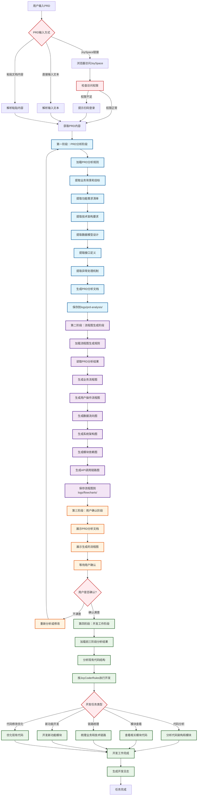
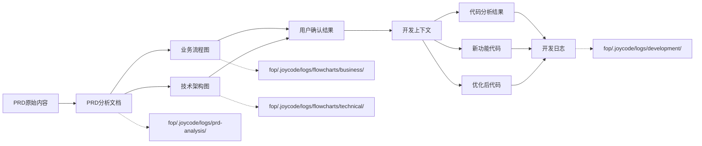
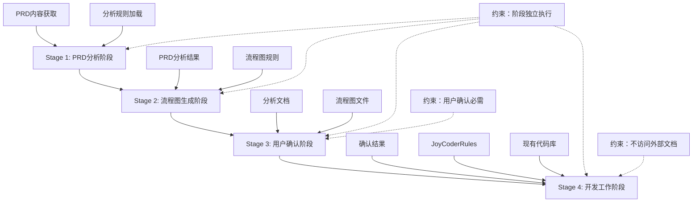

# 柯南智能体工作流程图

## 完整四阶段工作流程



## 数据流向图



## 阶段依赖关系图



## 配置文件关系图

```mermaid
graph TD
    A[fop-agent-config.json<br/>主配置文件] --> B[workflow配置]
    A --> C[joyspace配置]
    A --> D[logging配置]
    
    B --> E[四个阶段定义]
    B --> F[阶段依赖关系]
    B --> G[输入输出规则]
    
    H[prd-analysis-rules.json] --> I[PRD分析规则]
    J[flowchart-generation-rules.json] --> K[流程图生成规则]
    L[code-generation-rules.json] --> M[代码生成规则]
    
    N[agentDefinition.md] --> O[智能体定义规范]
    P[joycode-mcp.json] --> Q[MCP服务器配置]
    
    %% 文件引用关系
    A -.->|引用| H
    A -.->|引用| J
    A -.->|引用| L
    O -.->|定义规范| A
    Q -.->|服务支持| A